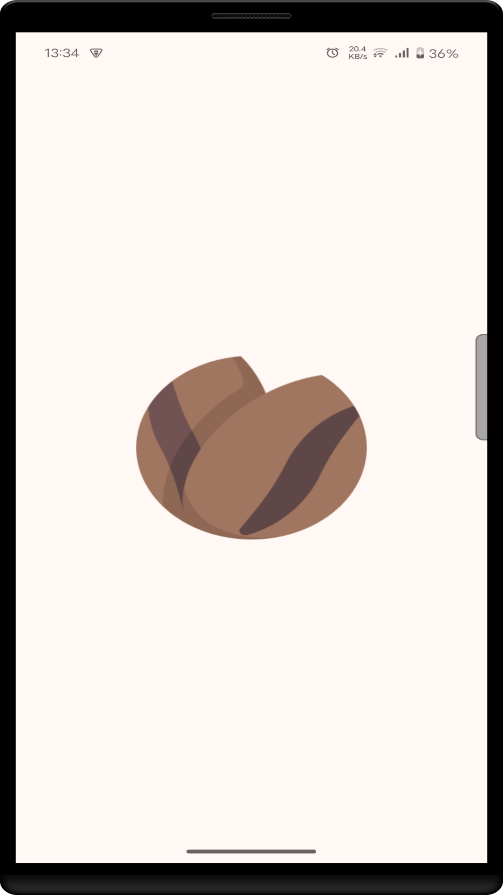
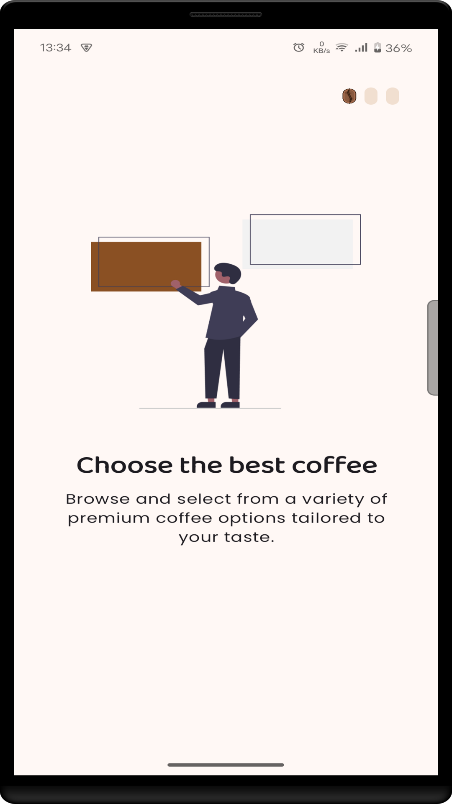
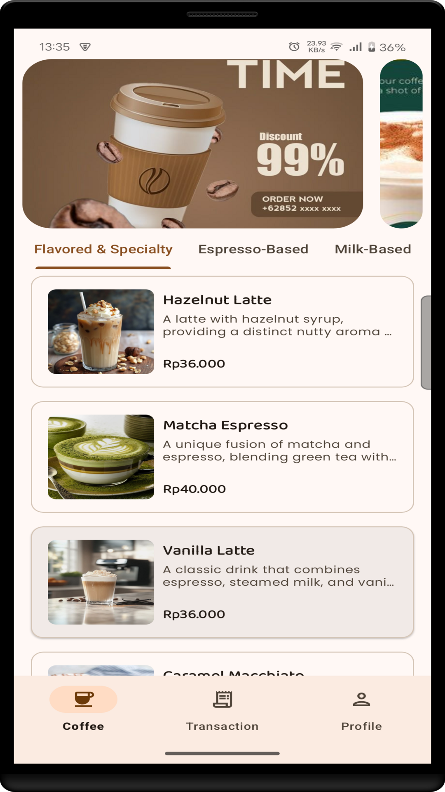
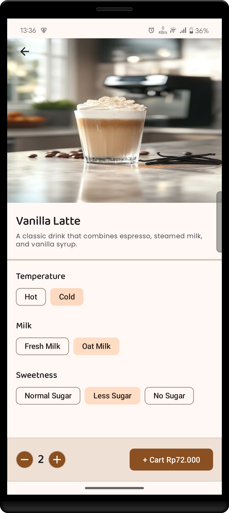
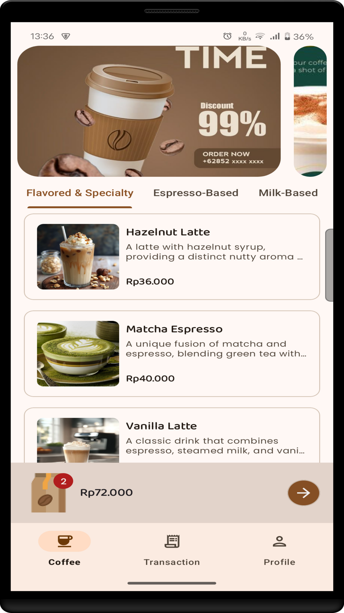
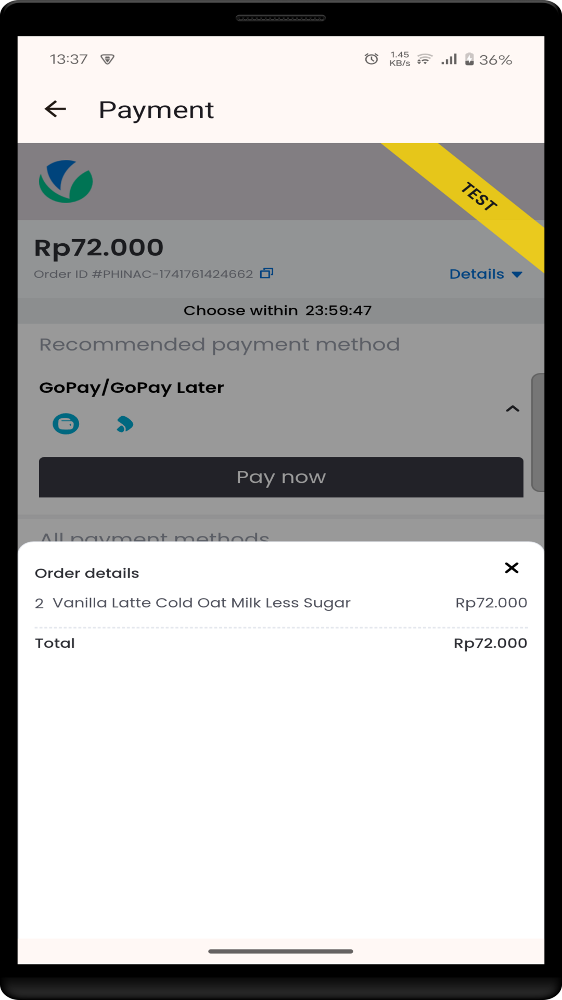
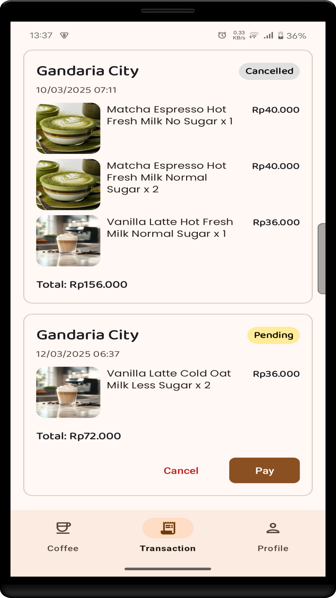
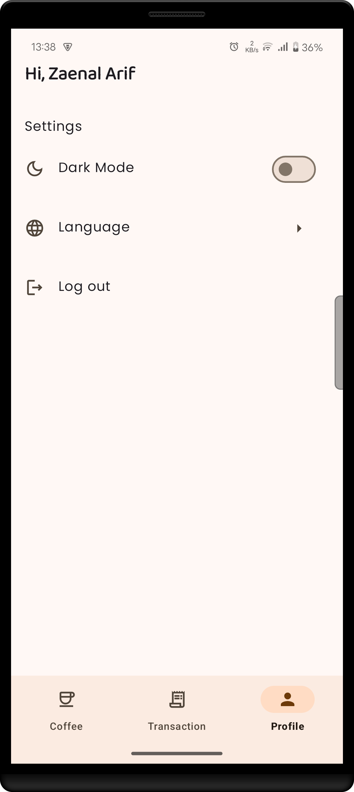

## Technology Used / Tech Stack

[](https://openjdk.org/)
[](https://developer.android.com/studio)

[](http://kotlinlang.org)
[](https://github.com/google/ksp)
[](https://developer.android.com/studio/releases/gradle-plugin)
[](https://developer.android.com/training/dependency-injection/hilt-android)
[](https://developer.android.com/jetpack/androidx/releases/navigation)
[](https://developer.android.com/jetpack/androidx/releases/lifecycle)
[](https://github.com/square/retrofit)
[](https://github.com/square/retrofit/blob/trunk/retrofit-converters/gson/README.md)
[](https://github.com/square/okhttp/tree/master/okhttp-logging-interceptor)
[](https://developer.android.com/jetpack/androidx/releases/datastore)
[](https://developer.android.com/jetpack/androidx/releases/room)
[](https://developer.android.com/develop/ui/views/launch/splash-screen)
[](https://coil-kt.github.io/coil/)
[](https://github.com/facebookarchive/shimmer-android)
[](https://developer.android.com/jetpack/androidx/releases/swiperefreshlayout)
[](https://developer.android.com/jetpack/androidx/releases/viewpager2)
[](https://firebase.google.com/)

# KOPHI

**KOPHI** adalah aplikasi untuk pecinta kopi yang memudahkan pengguna menemukan kopi berdasarkan
kategori dan memesan kopi dengan preferensi pengguna.

Aplikasi **KOPHI** menyediakan sistem pembayaran yang fleksibel, mendukung berbagai metode transaksi
termasuk debit maupun kredit.

## Table of Contents

- [Technology Used / Tech Stack](#technology-used--tech-stack)
- [Features](#features)
- [Installation (How to run the project)](#installation-how-to-run-the-project)
- [Tree / Folder Structure](#tree--folder-structure)
- [Architecture](#architecture)
- [Design Pattern](#design-pattern)
- [Todos](#todos)
- [Done](#done)
- [Bugs](#bugs)
- [Flowchart](#flowchart)
- [Preview](#preview)
- [Demo](#demo)
- [Credit / Contributor(s)](#credit--contributors)

## Features

> - **Preferensi**: Pengguna bisa menyesuaikan pemesanan kopi dimulai dari penyajian, jenis susu dan
    tingkat kemanisan.
>- **Pembayaran**: Pengguna bisa membayar tagihan dengan berbagai metode pembayaran yang tersedia.
>- **Transaksi**: Pengguna bisa melihat daftar transaksi dari berbagai status(*Expired*,
   *Cancelled*, *Paid* dan *Pending*), pengguna juga bisa melanjutkan pembayaran apabila status
   tersebut masih pending atau pengguna juga bisa membatalkan pesanan tersebut.
>- **Pengaturan**: Pengguna bisa mengaktifkan Mode Gelap ataupun mengubah bahasa.

## Installation (How to run the project)

To run the project locally, follow these steps:

### 1. Clone the repository

> - ```https://github.com/zenmobiledev/kophi.git```
>- ```cd kophi```

### 2. Open the project

> - Launch your preferred Integrated Development Environment (IDE), such as Android Studio or
    IntelliJ IDEA. Then, open the ```kophi``` project directory within the IDE.

### 3. Build the project

Ensure that all necessary dependencies are installed. In Android Studio or IntelliJ IDEA, you can
typically do this by:

> - **Syncing the Project**: The IDE should automatically prompt you to sync the project with the
    Gradle files. If not, you can manually sync by clicking on the "Sync Project with Gradle Files"
    button.
>- **Building the Project:** Navigate to the ```Build``` menu and select ```Build Project```. This
   process will compile the code and prepare the application for running.

### 4. Run the application

After the build process completes successfully:

> - **Select a Device**: Choose an emulator or a physical device connected to your computer where
    you want to run the application.

> - **Launch the App**: Click on the green 'Run' button (usually depicted as a play icon) in the IDE
    toolbar, or navigate to ```Run``` > ```Run 'app'```. This action will install and start the
    application on the selected device.

## Tree / Folder Structure

```
.
└── app
    └── src
        └── main
            └── java
                └── com
                    └── mobbelldev
                        └── kophi
                            ├── data
                            │   ├── mapper
                            │   │   └── Mapper.kt
                            │   ├── repository
                            │   │   └── CoffeeRepositoryImpl.kt
                            │   └── source
                            │       ├── local
                            │       │   ├── dao
                            │       │   │   └── CoffeeCartDao.kt
                            │       │   ├── database
                            │       │   │   └── AppDatabase.kt
                            │       │   ├── datasource
                            │       │   │   ├── CoffeeLocalDataSource.kt
                            │       │   │   └── CoffeeLocalDataSourceImpl.kt
                            │       │   ├── entity
                            │       │   │   └── CoffeeCartEntity.kt
                            │       │   └── preference
                            │       │       ├── PreferenceDataStore.kt
                            │       │       └── PreferenceParameter.kt
                            │       └── remote
                            │           ├── api
                            │           │   └── CoffeeService.kt
                            │           ├── datasource
                            │           │   ├── CoffeeRemoteDataSource.kt
                            │           │   └── CoffeeRemoteDataSourceImpl.kt
                            │           └── model
                            │               ├── request
                            │               │   ├── ContinueWithGoogleRequest.kt
                            │               │   └── OrderRequest.kt
                            │               └── response
                            │                   ├── AuthenticationResponse.kt
                            │                   ├── CancelOrderResponse.kt
                            │                   ├── CoffeeResponse.kt
                            │                   ├── OrderSnapResponse.kt
                            │                   └── OrdersResponse.kt
                            ├── di
                            │   ├── AppModule.kt
                            │   ├── LocalModule.kt
                            │   └── NetworkModule.kt
                            ├── domain
                            │   ├── interactor
                            │   │   └── CheckoutInteractor.kt
                            │   ├── model
                            │   │   ├── Authentication.kt
                            │   │   ├── CancelOrder.kt
                            │   │   ├── Coffee.kt
                            │   │   ├── CoffeeCart.kt
                            │   │   ├── ContinueWithGoogle.kt
                            │   │   ├── Order.kt
                            │   │   ├── OrderSnap.kt
                            │   │   └── Orders.kt
                            │   ├── repositories
                            │   │   └── CoffeeRepository.kt
                            │   └── usecase
                            │       ├── AuthenticationUseCase.kt
                            │       ├── CancelOrderUseCase.kt
                            │       ├── CheckoutUseCase.kt
                            │       ├── CoffeeUseCase.kt
                            │       ├── DecrementQuantityUseCase.kt
                            │       ├── DeleteAllOrdersUseCase.kt
                            │       ├── DeleteCoffeeCartUseCase.kt
                            │       ├── GetAllCartCoffeesUseCase.kt
                            │       ├── GetDarkModeUseCase.kt
                            │       ├── GetEmailUseCase.kt
                            │       ├── GetLanguageUseCase.kt
                            │       ├── GetOnBoardingUseCase.kt
                            │       ├── GetOrdersUseCase.kt
                            │       ├── GetTokenUseCase.kt
                            │       ├── GetUserIdUseCase.kt
                            │       ├── IncrementQuantityUseCase.kt
                            │       ├── InsertCoffeeCartUseCase.kt
                            │       ├── LogoutUseCase.kt
                            │       ├── SaveTokenUseCase.kt
                            │       ├── SaveUserIdUseCase.kt
                            │       ├── SetDarkModeUseCase.kt
                            │       ├── SetEmailUseCase.kt
                            │       ├── SetLanguageUseCase.kt
                            │       ├── SetOnBoardingUseCase.kt
                            │       └── UpdateQuantityAndSubtotalUseCase.kt
                            ├── presentation
                            │   └── ui
                            │       ├── authentication
                            │       │   ├── AuthenticationActivity.kt
                            │       │   └── AuthenticationViewModel.kt
                            │       ├── coffee
                            │       │   ├── adapter
                            │       │   │   └── CoffeeAdapter.kt
                            │       │   ├── ads
                            │       │   │   ├── adapter
                            │       │   │   │   └── AdsAdapter.kt
                            │       │   │   └── AdsActivity.kt
                            │       │   ├── checkout
                            │       │   │   ├── adapter
                            │       │   │   │   ├── AdapterCallback.kt
                            │       │   │   │   └── CheckoutAdapter.kt
                            │       │   │   ├── CheckoutActivity.kt
                            │       │   │   └── CheckoutViewModel.kt
                            │       │   ├── detail
                            │       │   │   └── CoffeeDetailActivity.kt
                            │       │   ├── payment
                            │       │   │   └── PaymentActivity.kt
                            │       │   ├── CoffeeFragment.kt
                            │       │   └── CoffeeViewModel.kt
                            │       ├── main
                            │       │   └── MainActivity.kt
                            │       ├── onboarding
                            │       │   ├── adapter
                            │       │   │   └── AppIntroViewPager2Adapter.kt
                            │       │   ├── AppIntroActivity.kt
                            │       │   └── AppIntroViewModel.kt
                            │       ├── profile
                            │       │   ├── language
                            │       │   │   ├── LanguageActivity.kt
                            │       │   │   ├── LanguageViewModel.kt
                            │       │   │   └── Languages.kt
                            │       │   ├── ProfileFragment.kt
                            │       │   └── ProfileViewModel.kt
                            │       └── transaction
                            │           ├── adapter
                            │           │   ├── ItemDetailTransactionAdapter.kt
                            │           │   ├── ItemTransactionAdapter.kt
                            │           │   └── OnItemClickListener.kt
                            │           ├── StatusPayment.kt
                            │           ├── TransactionFragment.kt
                            │           └── TransactionViewModel.kt
                            ├── utils
                            │   ├── CapitalizeFirst.kt
                            │   ├── ConvertDateTime.kt
                            │   ├── IDRCurrency.kt
                            │   └── ResultResponse.kt
                            └── MyApp.kt
```

## Architecture

| Architecture                              |
|-------------------------------------------|
|  |

## Design Pattern

*[Design Pattern](https://www.kodeco.com/18409174-common-design-patterns-and-app-architectures-for-android#toc-anchor-001)
**
>- Clean Architecture Pattern: Data Layer, Domain Layer, Presentation Layer
>- Repository Pattern
>- Dependency Injection Pattern
>- Use Case Pattern
>- MVVM (Model-View-ViewModel) Pattern
>- Adapter Pattern
>- Data Source Pattern
>- DAO (Data Access Object) Patern
>- Factory Pattern
>- Observer Pattern
>- Mapper Pattern
>- Singleton Pattern

## Todos

>- [ ] Unit Testing

## Done

**Point Penilaian**:
>- [x] Local Storage CRUD
>- [x] API Integration
>- [x] Payment Integration
>- [x] State Management
>- [x] Data Preferences
>- [x] Alert Dialog
>- [x] Firebase Crashlytics
>- [x] Dependency Management
>- [x] Firebase Authentication
>- [x] Code Obfuscation
>- [x] Code Quality
>- [x] App Distribution

**Fitur Aplikasi**:
>- [x]  Preferensi
>- [x]  Pembayaran
>- [x]  Transaksi
>- [x]  Pengaturan

## Bugs

> - [ ] Network Handling

## Flowchart

:exclamation: **COMING SOON**

## Preview

| Splash Screen                              | On Boarding / Walkthrough App                        | Authentication                               |
|--------------------------------------------|------------------------------------------------------|----------------------------------------------|
|  |  |  |

| Coffee Page 1                            | Coffee Detail Page                                   | Coffee Page 2                              |
|------------------------------------------|------------------------------------------------------|--------------------------------------------|
|  |  |  |

| Checkout Page                              | Payment Page                             | Transaction Page                                 |
|--------------------------------------------|------------------------------------------|--------------------------------------------------|
|  |  |  |

| Profile Page                             | 
|------------------------------------------|
|  | 

## Demo

:exclamation: **COMING SOON**

## Credit / Contributor(s)

- [Zaenal Arif](https://github.com/zenmobiledev)

